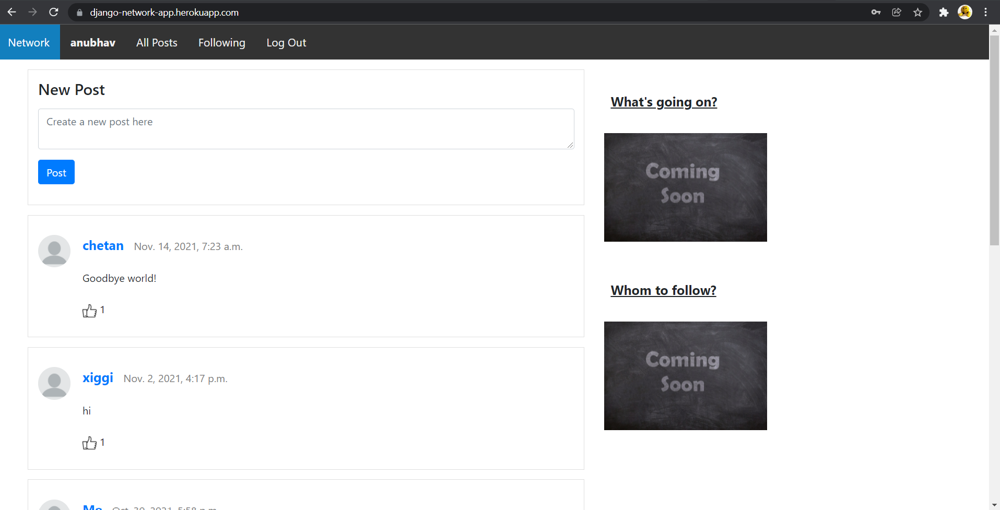

# NETWORK

<!-- PROJECT LOGO -->
 

  

  <b><h1 align="center">Network App!</h2></b>

  

    Network App! It is a twitter like social-networking web application built using Django
     
    <a href="https://github.com/anubhav06/networkApp"><strong>Explore the docs »</strong></a>
     
     
<!--     <a href="https://github.com/anubhav06/networkApp">View Demo</a> -->
    ·
    <a href="https://github.com/anubhav06/networkApp/issues">Report Bug</a>
    ·
    <a href="https://github.com/anubhav06/networkApp/issues">Request Feature</a>
  

<!-- TABLE OF CONTENTS -->
## :dart: Table of Contents

* [About the Project](#about-the-project)
  * [Built With](#built-with)
  * [Quick Try Out](#quick-try-out)
* [Getting Started](#getting-started)
  * [Installation](#installation)
* [Contributing](#contributing)
* [License](#license)

<!-- ABOUT THE PROJECT -->
##  :open_book: About The Project

  <a href="https://github.com/anubhav06/networkApp">
<!--   Add a GIF here  -->
  </a>

This is a twitter-like networking web application called `Network` made using Django and JavaScript  
Users can Create Post/Edit a post, Follow/Unfollow a user, Like/Unlike a post  

Deployed at https://django-network-app.herokuapp.com/.

This was made to understand the concepts of Django and Web Development. Also, the best way to understand is by building a real world existing project. Thus, presenting 'Network' which helps in understanding how to make a social-networking web application.

### How we built it

The backend is built using `Django` framework. While the frontend is built using `HTML, CSS and JavaScript`. 

### Quick Try Out

To get a quick hands-on experience of how the project works:
1. Go to https://django-network-app.herokuapp.com/
2. Login using the below credentials:
`Username: test`
`Password: test`

## :rocket:  What's next for NetworkApp!
We have many features planned for NetworkApp in the future:

* Improving the styling and desgin of frontend.
* Adding Whom to follow, What's going on
* Better user profiles - more customizable and uploading profile images.

<!-- GETTING STARTED -->
## :airplane: Getting Started

To get a local copy up and running follow these simple steps.

### Installation

1. Clone this GitHub repo 
2. Install Python from https://www.python.org/ with the default settings (Make sure to add it to `PATH`)
3. Run `pip install -r requirements.txt` to install the dependencies.
4. Run `python manage.py migrate` to migrate the database.
5. Run `python manage.py runserver` to start the server.

<!-- CONTRIBUTING -->
## :mechanical_arm: Contributing

It's open to suggestions and contributions!  
You can create issues and PR's but it will start to merge after 1 January 2022 !

1. Fork the Project
2. Create your Feature Branch (`git checkout -b feature/AmazingFeature`)
3. Commit your Changes (`git commit -m 'feat: Add some AmazingFeature'`)
4. Push to the Branch (`git push -u origin feature/AmazingFeature`)
5. Open a Pull Request

See the [open issues](https://github.com/anubhav06/networkApp/issues) for a list of proposed features (and known issues).

<!-- LICENSE -->
##  :page_facing_up: License

Distributed under the MIT License. See [`LICENSE`](./LICENSE) for more information.

